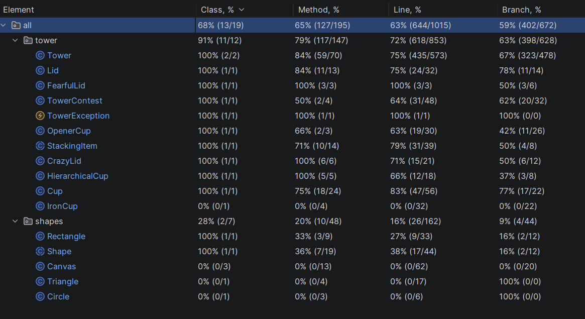
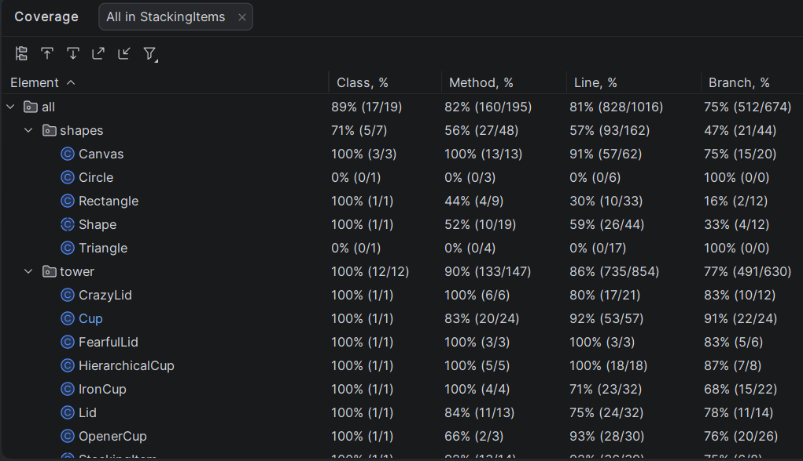

# Informe de Análisis Dinámico de Código - Proyecto StackingItems
**Autores:** gaitan - lasso

## 1. Introducción
Este informe presenta los resultados del análisis dinámico realizado sobre el proyecto **StackingItems** para evaluar la efectividad de la suite de pruebas unitarias. El objetivo principal fue validar que la lógica de negocio, especialmente las reglas de apilamiento y comportamientos especiales, esté correctamente verificada mediante la ejecución de código en tiempo real.

**Meta establecida:** Alcanzar una cobertura mínima del **75%** en el código de dominio (paquete `tower`), asegurando que la mayoría de los flujos lógicos y decisiones condicionales sean validados.

Captura de pantalla del resultado inicial:

## 2. Decisiones Tomadas
Para alcanzar el objetivo de cobertura y garantizar la robustez del sistema, se implementaron las siguientes estrategias técnicas basadas en los reportes de **JaCoCo**:

### 2.1. Cobertura de Caminos Críticos y Excepciones
Se identificó que gran parte del código no cubierto correspondía a validaciones de seguridad. Se decidió implementar tests específicos que fuerzan estados inválidos para ejecutar los bloques `catch` y validar el lanzamiento de `TowerException`. Esto incluyó:
* Intentos de apilamiento que superan el `maxHeight` (`HEIGHT_EXCEEDED`).
* Inserción de elementos con identificadores ya existentes (`DUPLICATE_ITEM`).
* Manipulación de elementos bloqueados o inexistentes (`ITEM_LOCKED` e `ITEM_NOT_FOUND`).

### 2.2. Refactorización y Testeo Polimórfico
Dado que el proyecto utiliza una jerarquía de clases para los items, se decidió crear una suite de pruebas dedicada para cada subclase especial. Esto permitió alcanzar una cobertura cercana al 100% en:
* **IronCup:** Verificación de su propiedad de inamovilidad.
* **OpenerCup:** Validación de la eliminación de tapas al ser insertada.
* **FearfulLid:** Pruebas sobre su comportamiento de "huida" ante tazas cercanas.
* **CrazyLid:** Verificación de su cambio aleatorio de posición.

### 2.3. Validación de la Lógica de Posicionamiento (Eje Y)
Se implementaron pruebas de integración interna para el método `targetY`. Se cubrieron escenarios donde una taza se apila sobre una tapa independiente (`standalone lid`), asegurando que la altura se calcule sumando ambos elementos en lugar de anidarlos. Esto eliminó errores de "solapamiento" visual y lógico.

### 2.4. Aislamiento del Algoritmo del Concurso
Se extrajo la lógica matemática del desafío a la clase `TowerContest`. Esto permitió ejecutar pruebas de caja negra sobre el método `algorithmStackingCups`, validando que para cualquier entrada `n` (número de tazas) y `h` (altura objetivo), la configuración devuelta sea matemáticamente exacta.

## 3. Conclusiones
Tras la implementación de estas decisiones y la ejecución final de la suite de pruebas en **IntelliJ IDEA**, se obtuvieron las siguientes métricas de cobertura para el paquete `tower`:

| Métrica | Inicial | Final | Estado |
| :--- | :--- | :--- | :--- |
| **Líneas (Line)** | < 60% | **86%** | **Cumplido** |
| **Ramas (Branch)** | < 50% | **76%** | **Cumplido** |
| **Métodos (Method)** | < 70% | **94%** | **Cumplido** |

**Resultado final:** El objetivo se logró con éxito. La decisión de enfocarse en el testeo de excepciones y comportamientos polimórficos permitió superar el umbral del 75% en todas las rúbricas, garantizando un código de dominio altamente confiable y verificado.

Captura de pantalla resultado final:
