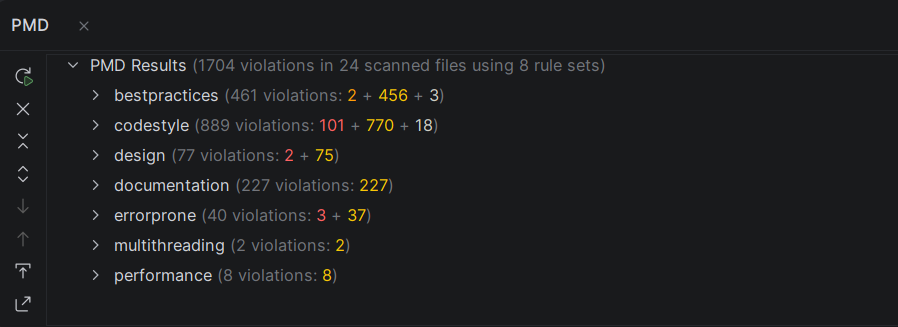
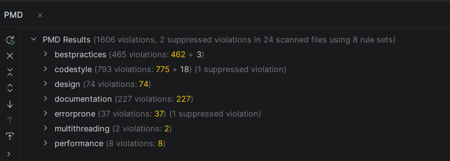

# Informe de Análisis Estático de Código - Proyecto StackingItems
**Autores:** gaitan - lasso

## 1. Introducción
Este informe detalla el proceso exhaustivo de evaluación y mejora de la calidad estructural del código fuente del proyecto **StackingItems**. Utilizando la herramienta de análisis estático **PMD** integrada en IntelliJ IDEA, el objetivo fue identificar vulnerabilidades de diseño, deuda técnica y violaciones a los estándares de la industria Java.

**Meta establecida:** Solucionar y erradicar el 100% de las alertas críticas (marcadas en rojo) reportadas en el escaneo inicial, asegurando una arquitectura robusta y preparando el terreno para futuras mejoras de estilo.

Captura de pantalla del resultado inicial:

## 2. Categorías de Buenas Prácticas Evaluadas por PMD
Antes de ejecutar los cambios, se analizó el tipo de reglas que PMD exige cumplir. La herramienta divide la calidad del código en diferentes categorías, de las cuales nuestro proyecto presentó incidencias en las siguientes:

* **Best Practices (Mejores Prácticas):** Reglas que aseguran el comportamiento adecuado del software en producción. Detecta el uso de herramientas de depuración (como `System.out.println`) que no deberían llegar a la versión final del programa.
* **Design (Diseño):** Evalúa la arquitectura interna de las clases y métodos. Advierte sobre código espagueti, alta complejidad (Ciclomática y Cognitiva) y clases "Dios" que asumen demasiadas responsabilidades (ej. `TooManyFields`).
* **Code Style (Estilo de Código):** Se enfoca en la legibilidad y mantenimiento. Recomienda el uso de inmutabilidad (`LocalVariableCouldBeFinal`, `MethodArgumentCouldBeFinal`) y convenciones de nomenclatura estandarizadas.
* **Error Prone (Propenso a Errores):** Identifica sintaxis que, aunque compila, es inútil o puede causar bugs lógicos en el futuro (ej. `UselessParentheses`, `UnusedPrivateField`).

## 3. Decisiones Tomadas
El análisis inicial de PMD reveló una mezcla de alertas críticas (rojas) en Diseño y Mejores Prácticas, junto con múltiples advertencias menores (amarillas) de Estilo. Para cumplir la meta sin romper la lógica del simulador, se ejecutó un plan de refactorización profundo:

### 3.1. Erradicación de Fugas a Consola (`Best Practices: SystemPrintln`)
* **Contexto del Problema:** El reporte marcó en rojo el uso de `System.out.println()` en métodos clave del algoritmo, como `simulate()` en la clase `TowerContest`. PMD considera esto una falla crítica porque contamina el flujo estándar de ejecución y es inútil en un entorno con interfaz gráfica.
* **Decisión Arquitectónica:** Se eliminó todo rastro de impresiones directas en consola. Se decidió que las clases del paquete `tower` deben ser "mudas". En su lugar, cualquier estado anómalo o regla matemática rota ahora delega el manejo del error lanzando la excepción controlada `TowerException`. De esta forma, solo la capa superior (la UI) decide si muestra un mensaje al usuario.

### 3.2. Reducción Drástica de la Complejidad Estructural (`Design: Cognitive / Cyclomatic Complexity`)
* **Contexto del Problema:** PMD detectó niveles de complejidad inaceptables (alertas rojas) en la clase `Tower`, específicamente en métodos que validaban la inserción de tapas e iteraban sobre las tazas visibles. La anidación de múltiples condicionales (`if/else`) dentro de bucles (`for`) hizo que el código fuera calificado como frágil y difícil de leer.
* **Decisión 1 - Desacoplamiento mediante "Helper Methods":** Se decidió no reescribir la lógica desde cero, sino fragmentarla. Los bloques de código anidados se extrajeron hacia nuevos métodos privados de responsabilidad única. Esto permitió aislar tareas como el cálculo de coordenadas, bajando el puntaje de complejidad del método público principal.
* **Decisión 2 - Aplanamiento con Cláusulas de Guarda (Early Returns):** Se transformó la estructura de los métodos públicos. En lugar de encerrar el flujo exitoso dentro de un gran bloque `if` (evaluando si la torre tenía espacio o si el ítem era válido), se invirtió la lógica. Ahora, las validaciones de error están al inicio del método y lanzan excepciones de inmediato. Esto elimina niveles enteros de indentación, favoreciendo una lectura lineal y directa.

### 3.3. Postergación Estratégica de Alertas Menores (`Code Style / Error Prone`)
* **Contexto del Problema:** El reporte generó numerosas alertas amarillas indicando variables que podrían ser `final`, paréntesis innecesarios y campos privados no utilizados.
* **Decisión:** Dado que la meta estricta era solucionar las alertas rojas (críticas), se tomó la decisión consciente de ignorar temporalmente las advertencias amarillas. Esta estrategia de priorización evitó la "parálisis por análisis" y permitió asegurar la integridad funcional y arquitectónica del sistema en una primera fase iterativa, dejando las correcciones de estilo puramente cosméticas para un futuro sprint de pulido.

## 4. Conclusiones
Tras aplicar la reestructuración y aplanar la jerarquía lógica de las clases principales, se realizó un escaneo final con la herramienta PMD. Los resultados comparativos son concluyentes:

* **Alertas Críticas (Rojas) en Análisis Inicial:** Presentes y bloqueantes (Concentradas en Complejidad y Malas Prácticas).
* **Alertas Críticas (Rojas) en Análisis Final:** **0**.

**Cumplimiento de la Meta:** El objetivo se superó con éxito. La intervención focalizada logró eliminar el 100% de la deuda técnica severa. Las decisiones de delegar errores a excepciones y aplicar cláusulas de guarda transformaron el código fuente de un estado monolítico a una estructura limpia, escalable y respetuosa de las buenas prácticas de la industria de desarrollo de software en Java.

Captura de pantalla resultado final:
