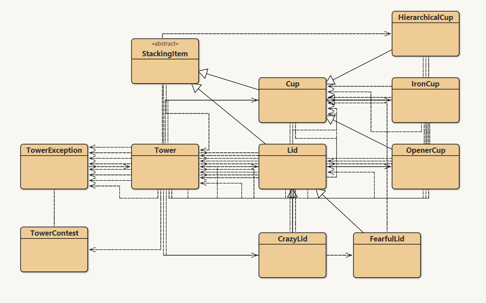
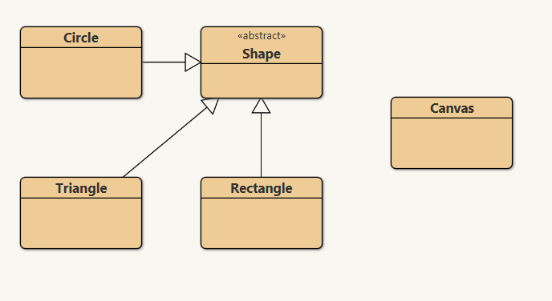
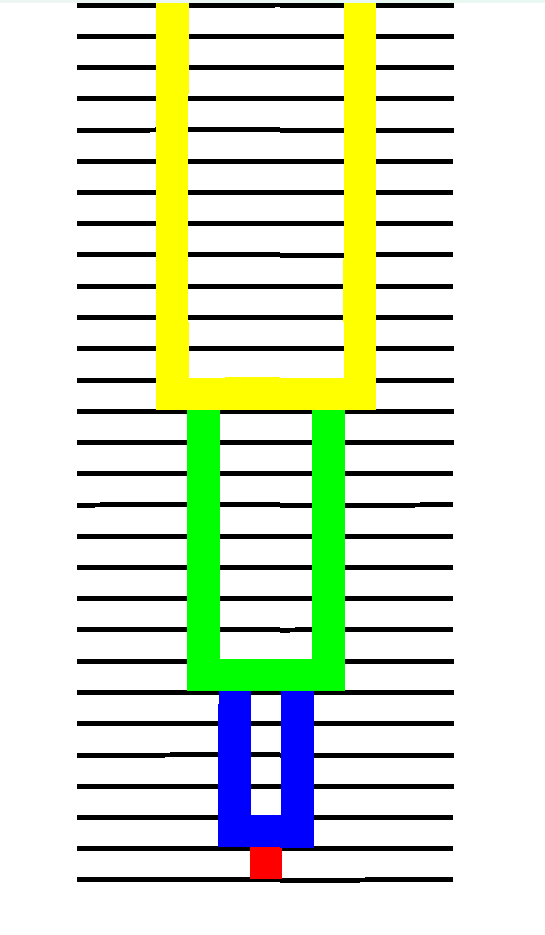

# 🏆 Stacking Items 🏗️

## 📝 Introducción
**Stacking Items** es un simulador visual y un solucionador algorítmico inspirado en el famoso problema "Stacking Cups" (Problema J) de la Maratón Internacional de Programación ICPC 2025. 🥇 El proyecto permite a los usuarios interactuar con torres formadas por diferentes tipos de tazas y tapas, además de calcular cómo apilarlas para alcanzar una altura objetivo exacta. 📏

👨‍💻 **Desarrolladores:** Juan Diego Gaitán y Oscar Lasso 
🎓 **Institución:** Escuela Colombiana de Ingeniería Julio Garavito (5to Semestre - Desarrollo Orientado por Objetos)

---

## 🏃‍♂️ Metodología
El proyecto se construyó de manera progresiva, dividiendo el trabajo en **ciclos de desarrollo** (mini-ciclos). 🔄 Se adoptaron enfoques de la **Programación Ágil y Extreme Programming (XP)**, priorizando que el código fuera fácil de leer, probar y extender. 📈

* **Ciclo 1 - La Base:** 🧱 Simulador básico (crear torre, apilar, consultar altura).
* **Ciclo 2 - Interacción:** 🖐️ Intercambio de objetos y búsqueda de movimientos para reducir altura.
* **Ciclo 3 - El Solucionador:** 🧠 Algoritmo para resolver el problema original de la maratón ICPC.
* **Ciclo 4 - Extensión Compleja:** 🌪️ Nuevos tipos de tazas y tapas con reglas especiales.
* **Cierre y Calidad:** ✅ Uso de **IntelliJ IDEA**, **JaCoCo** (cubrimiento > 75%) y **PMD** (código limpio). Todas las pruebas bajo el patrón **AAA (Arrange, Act, Assert)**. 🧪

---

## 🏛️ Diseño
El diseño arquitectónico separa lo visual de la lógica, logrando alta **Reutilización y Extensibilidad** 🧩. 

Captura Diseño de Dominio:

Captura Diseño de Shapes:

📦 **Paquetes principales:**
* 🎨 `shapes`: Maneja la interfaz gráfica (Círculos, Rectángulos, Triángulos y el Canvas).
* ⚙️ `tower`: Contiene el cerebro y las reglas lógicas.

**¿Por qué este diseño?** 🤔
Mediante la *herencia*, todo nace de una clase base `StackingItem`. De ella derivan `Cup` (Taza) y `Lid` (Tapa), permitiendo crear versiones especiales (ej. Taza Jerárquica) sin dañar el simulador original. Los errores se controlan con la clase personalizada `TowerException`. 🛡️

---

## ✨ Funcionalidades
El simulador es un entorno completamente interactivo 🕹️:

* 🏗️ **Gestión Manual:** Crear torres, agregar/quitar piezas una por una.
* 🔀 **Reorganización Inteligente:** Ordenar, invertir o intercambiar piezas.
* 🪄 **Comportamientos Especiales:**
    * 💥 *Opener Cup:* Destruye las tapas que le estorban.
    * 👑 *Hierarchical Cup:* Empuja a las tazas más pequeñas hacia arriba.
    * 🙃 *Crazy Lid:* Se coloca debajo de la taza como base.
    * 🫣 *Fearful Lid:* Solo entra si su taza está adentro; no sale si la está protegiendo.
* 📐 **Cálculos Dinámicos:** Calcula la altura exacta considerando que las tazas encajan unas dentro de otras.
* 🏆 **Solucionador ICPC:** Calcula el orden exacto para ganar el reto de la maratón y lo grafica.

Captura de ejemplo de una torre:

---

## 🚀 Por mejorar
Para futuras versiones o extensiones del proyecto 🔮:

1.  🖥️ **Interfaz Gráfica Moderna:** Migrar del `Canvas` básico a JavaFX o Spring Boot (Web) para permitir "Drag & Drop" con el mouse.
2.  🎬 **Animaciones Fluidas:** Mostrar visualmente cómo caen o rebotan las piezas al apilarse.
3.  ⚡ **Optimización (Big Data):** Implementar programación dinámica para resolver el reto ICPC con millones de tazas en milisegundos.
4.  🤖 **Integración Continua (CI/CD):** Configurar GitHub Actions para ejecutar pruebas automáticas (JaCoCo/PMD) en cada nuevo cambio subido al repositorio.

